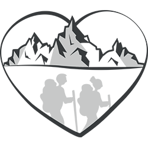

# [randomonamour.fr](https://www.randomonamour.fr)

  

---

This repository contains [randomonamour.fr](https://www.randomonamour.fr), a personal blog about trekking, bivouac and gear reviews.
You will find articles and photos about our last hikings in mountains we love.

The website is built with [Hugo](https://gohugo.io), a simple static site generator written
in [https://golang.org](Golang) and hosted on [OVHcloud](https://www.ovhcloud.com).

> **_DISCLAIMER:_** Please note that all blog posts are written in french 🇫🇷.

## Contributions

If you find a mistake or bug, it would be very helpful if you open an issue, or send us an email.

As this is our personal blog, we do not currently invite guest posts.

## License

 This work is licensed under a <a rel="license" href="http://creativecommons.org/licenses/by-nc-sa/4.0/">Creative Commons Attribution-NonCommercial-ShareAlike 4.0 International License</a>.
